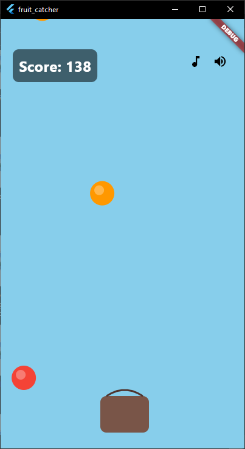
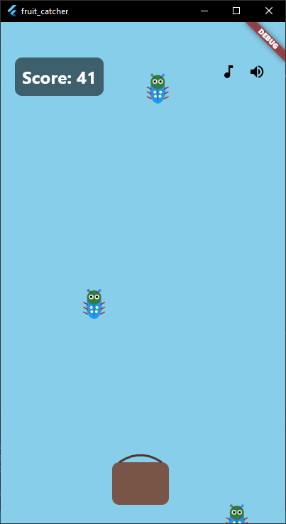

# 🐞 Flutter Fruit Catcher (Versi Bug Edition)

Tugas mata kuliah **Mobile App**.
Aplikasi ini merupakan game sederhana **Fruit Catcher** yang telah dimodifikasi, di mana objek buah yang awalnya berbentuk lingkaran telah diubah menjadi bug/kumbang.

---

## 📸 Hasil Screenshot

<p align="center">
  
  
</p>

---

## 🎮 Deskripsi Game

Game ini merupakan permainan sederhana di mana pemain harus menangkap objek yang jatuh dari atas layar dan dapatkan score sebanyak banyaknya.

## ✨ Perubahan yang Dilakukan

Mengubah objek dari lingkaran (fruit) menjadi bug/kumbang

Menyesuaikan tampilan visual agar lebih menarik

Tetap mempertahankan mekanisme dasar permainan (gerak, collision, skor)

---

## 👤 Identitas

| Keterangan       | Data           |
| ---------------- | -------------- |
| **Nama Lengkap** | Ari Firmansyah |
| **NIM**          | 1123150127     |

---

## 🚀 Cara Menjalankan Project

> Pastikan sudah menginstal **Flutter SDK** minimal versi **3.x.x**

1. Jalankan perintah berikut:

   ```bash
   flutter pub get
   ```

2. Jalankan project di device atau emulator:

   ```bash
   flutter run
   ```

---

## 🧠 Konsep yang Digunakan

- Widget dasar Flutter

- StatefulWidget untuk state management sederhana

- Timer / game loop sederhana

- Collision detection

- Random position generation

---

## 📌 Catatan

Game ini masih merupakan versi sederhana dan dapat dikembangkan lebih lanjut, seperti:

- Penambahan level

- Variasi jenis bug

- Animasi yang lebih smooth

- Sistem high score


